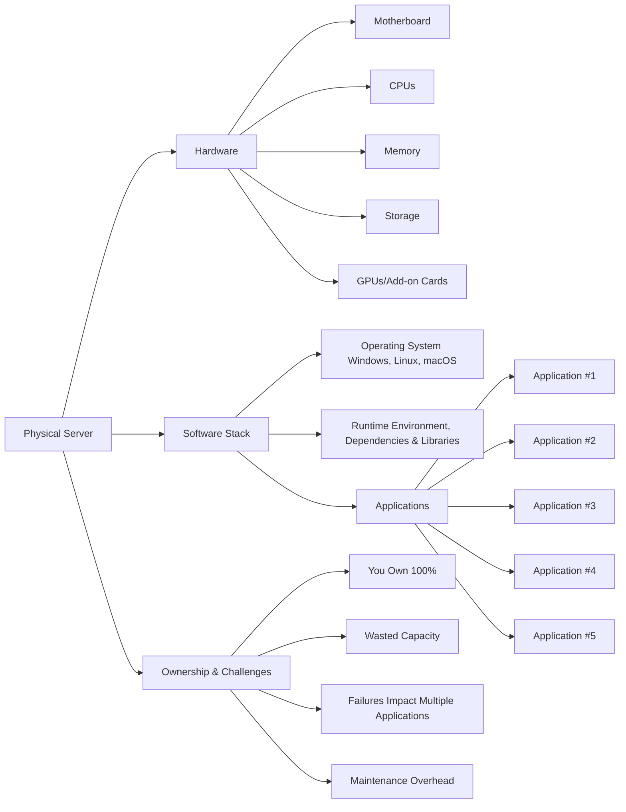

Ideally the basic understanding of Physical vs Virtual servers is needed. 

```mermaid
graph LR
    A[Physical Server] --> B[Hardware]
    B --> B1[Motherboard]
    B --> B2[CPUs]
    B --> B3[Memory]
    B --> B4[Storage]
    B --> B5[GPUs/Add-on Cards]
    
    A --> C[Software Stack]
    C --> C1[Operating System Windows, Linux, macOS]
    C --> C2[Runtime Environment, Dependencies & Libraries]
    C --> C3[Applications]
    C3 --> C3_1[Application #1]
    C3 --> C3_2[Application #2]
    C3 --> C3_3[Application #3]
    C3 --> C3_4[Application #4]
    C3 --> C3_5[Application #5]
    
    A --> D[Ownership & Challenges]
    D --> D1[You Own 100%]
    D --> D2[Wasted Capacity]
    D --> D3[Failures Impact Multiple Applications]
    D --> D4[Maintenance Overhead]
```
